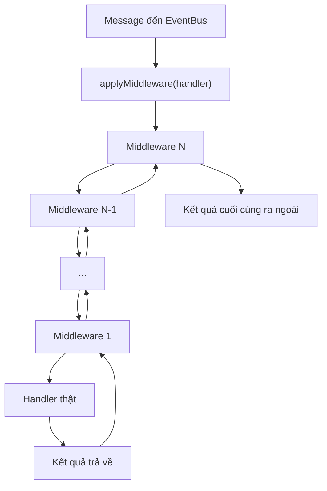

# Go EventBus (Redis Pub/Sub)

## Giới thiệu

`go-eventbus` là một thư viện EventBus đơn giản cho Golang, sử dụng Redis Pub/Sub để giao tiếp giữa các service hoặc goroutine. Thư viện hỗ trợ:
- Đăng ký handler cho từng topic (event name)
- Gửi message (publish/subscribe)
- Hỗ trợ request-reply (Send/Handle)
- Middleware dạng chain (logging, validate, ...)

Phù hợp cho các ứng dụng microservice, event-driven hoặc cần giao tiếp bất đồng bộ.

## Cài đặt

```bash
go get github.com/xhkzeroone/eventbus-demo/eventbus
```

## Hướng dẫn sử dụng

### 1. Khởi tạo EventBus
```go
bus := eventbus.NewEventBus("localhost:6379")
```

### 2. Thêm middleware (tuỳ chọn)
```go
bus.Use(LoggingMiddleware)
bus.Use(RejectEmptyMiddleware)
```

### 3. Đăng ký handler cho event
```go
bus.Handle("math.add", func(data json.RawMessage) any {
    var req AddRequest
    _ = json.Unmarshal(data, &req)
    return AddResponse{Result: req.A + req.B}
})
```

### 4. Gửi request và nhận phản hồi
```go
req := AddRequest{A: 10, B: 20}
resp, err := bus.Send("math.add", req, 3*time.Second)
if err != nil {
    // Xử lý lỗi
}
var res AddResponse
_ = json.Unmarshal(resp, &res)
fmt.Println("Kết quả:", res.Result)
```

### 5. Publish/Subscribe đơn giản
```go
// Publish
data := map[string]interface{}{"msg": "hello"}
bus.Publish("mytopic", data)

// Subscribe
bus.Subscribe("mytopic", func(msg []byte) {
    fmt.Println("Nhận được:", string(msg))
})
```

## Cơ chế Middleware (Logging, Validate, ...)

Khi bạn dùng `bus.Use(...)`, các middleware sẽ được "bọc" quanh handler thật. Nhờ đó, bạn có thể log, kiểm tra, sửa đổi message in/out rất linh hoạt.

### Flow hoạt động của middleware chain:



- Message đi vào sẽ lần lượt qua từng middleware (từ cuối đến đầu, do for i := len-1; i >= 0).
- Middleware cuối cùng sẽ gọi middleware kế trước, cứ thế cho đến middleware đầu tiên.
- Middleware đầu tiên gọi handler thật.
- Kết quả trả về sẽ đi ngược lại qua từng middleware, cho đến khi ra ngoài.

Nhờ vậy, bạn có thể log, validate, sửa đổi message in/out mà không cần sửa handler thật.

## Ưu điểm
- **Đơn giản, dễ dùng**: API rõ ràng, dễ tích hợp vào dự án Go.
- **Hỗ trợ middleware**: Có thể thêm logging, validate, auth... như HTTP handler.
- **Request-Reply pattern**: Gửi request và nhận phản hồi dễ dàng.
- **Dựa trên Redis**: Tận dụng Redis Pub/Sub, phù hợp cho môi trường phân tán, microservice.

## Nhược điểm
- **Phụ thuộc Redis**: Cần Redis server đang chạy.
- **Không đảm bảo delivery**: Redis Pub/Sub không lưu message, nếu subscriber offline sẽ mất message.
- **Chưa có retry, dead-letter**: Không tự động retry hoặc lưu message lỗi.
- **Chưa có unsubscribe tự động cho handler lâu dài**: Cần tự quản lý nếu subscribe nhiều topic động.

## Đóng góp
Pull request, issue, góp ý đều được hoan nghênh!

---

**Tác giả:** [xhkzeroone](https://github.com/xhkzeroone) 